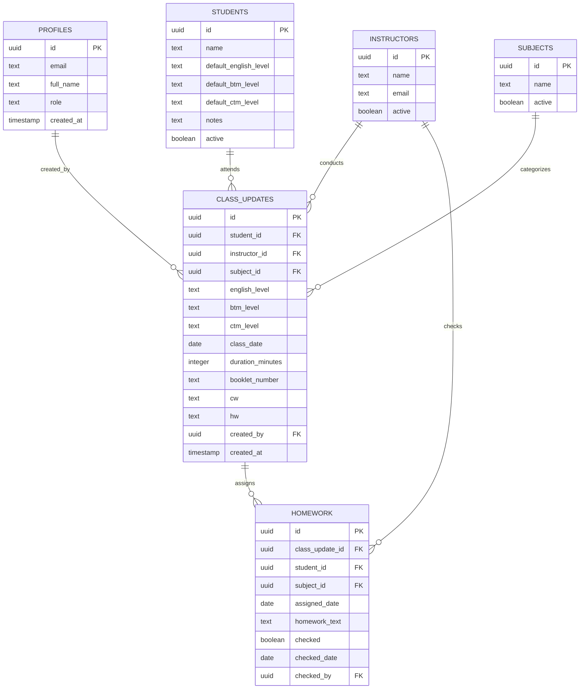

# Technical Architecture & Developer Documentation

## 1. System Overview & Technology Stack

The **Class Management & Homework Tracking System** is a modern Single Page Application (SPA) designed for educational centers and tutoring institutes. It provides atomic class recording, curriculum level tracking, homework accountability workflows, role-based security, and real-time analytics.

### Core Tech Stack
* **Frontend Framework:** React 18 (Functional components, Hooks)
* **Language:** TypeScript 5.5+ (Strict type checking)
* **Build Tool:** Vite 6
* **Styling & Design System:** Tailwind CSS v3 with custom responsive mobile breakpoints
* **Icons:** Lucide React
* **Date Utilities:** `date-fns` v3 (ISO date parsing, MTD/monthly range calculations)
* **Backend as a Service:** Supabase (PostgreSQL 15, GoTrue Authentication, Row Level Security, Stored Procedures)
* **Hosting & CDN:** Cloudflare Pages (with SPA client-side routing via `_redirects`)

---

## 2. Architecture & Directory Structure

```
class_management/
├── public/
│   ├── _redirects                  # Cloudflare Pages SPA routing rewrite (/* /index.html 200)
│   └── favicon.svg
├── src/
│   ├── components/
│   │   ├── ChangePasswordModal.tsx # Instructor/Admin self-service password update modal
│   │   ├── ClassDurationPicker.tsx # Preset (30m, 45m, 1h, 1.5h, 2h) & custom minute input
│   │   ├── LevelSelector.tsx       # Dynamic curriculum level selector (English, BTM, CTM, Summit, None)
│   │   ├── Navbar.tsx              # Responsive header, hamburger drawer & mobile sticky bottom nav
│   │   ├── PendingHomeworkList.tsx # Interactive previous homework checklist with batch toggle
│   │   ├── ProtectedRoute.tsx      # Role-based route guard (authenticated / admin only)
│   │   └── StudentSelect.tsx       # Searchable student selection combobox
│   ├── constants/
│   │   └── levels.ts               # Standard curriculum definitions, reverse display orders & formatters
│   ├── contexts/
│   │   └── AuthContext.tsx         # Session provider, live onAuthStateChange, auto-profile fallback
│   ├── lib/
│   │   ├── api.ts                  # Centralized API abstraction layer (Dual Mode: Supabase + Local Sandbox)
│   │   └── supabase.ts             # Supabase client singleton & publishable key detection
│   ├── pages/
│   │   ├── AdminManagement.tsx     # Student CRUD, default level assignments, instructor password resets
│   │   ├── ClassHistory.tsx        # Multi-filter records history (Desktop table + Mobile card views)
│   │   ├── Login.tsx               # Supabase authentication form with optional ?displaysandbox mode
│   │   ├── NewClassUpdate.tsx      # Atomic class recording, level memory, and homework checkoff
│   │   └── Reports.tsx             # Performance metrics, hours breakdown, instructor auto-lock
│   ├── types/
│   │   └── index.ts                # TypeScript entity contracts
│   ├── App.tsx                     # React Router 6 configuration
│   ├── main.tsx                    # Application bootstrap
│   └── vite-env.d.ts               # Vite import.meta.env type declarations
├── supabase_schema.sql             # Complete PostgreSQL DDL, atomic RPCs, RLS policies & seed data
├── tailwind.config.js
├── tsconfig.json
├── package.json
└── .env.example
```

---

## 3. Database Schema & Data Models

### 3.1 Entity Relationship Diagram



### 3.2 Key Database Tables

1. **`public.profiles`**: Extends `auth.users`. Contains user display metadata and authorization role (`admin` vs `instructor`).
2. **`public.instructors`**: Master directory of teachers. Correlated with Supabase Auth users via email matching.
3. **`public.students`**: Master student roster storing default enrollment levels (`default_english_level`, `default_btm_level`, `default_ctm_level`). Supports single-subject enrollment by allowing `None` / `NULL`.
4. **`public.subjects`**: Academic disciplines (`English`, `Math`).
5. **`public.levels`**: Normalized curriculum levels with custom `display_order` definitions.
6. **`public.class_updates`**: Immutable record of every completed teaching session. Enforces duplicate protection via compound unique index on `(student_id, instructor_id, subject_id, class_date)`.
7. **`public.homework`**: Granular assignment tracking. Created whenever `hw` text is populated during class updates. Checked off with timestamp and instructor audit reference.

---

## 4. PostgreSQL Stored Procedures & Atomic Transactions

To prevent partial updates, race conditions, and client-side privilege escalation, mission-critical operations run through PostgreSQL `SECURITY DEFINER` functions:

### 4.1 `public.save_class_update` (Atomic Class + Homework Processing)
```sql
CREATE OR REPLACE FUNCTION public.save_class_update(
    p_student_id UUID,
    p_instructor_id UUID,
    p_subject_id UUID,
    p_class_date DATE,
    p_duration_minutes INTEGER,
    p_english_level TEXT DEFAULT NULL,
    p_btm_level TEXT DEFAULT NULL,
    p_ctm_level TEXT DEFAULT NULL,
    p_booklet_number TEXT DEFAULT NULL,
    p_cw TEXT DEFAULT NULL,
    p_hw TEXT DEFAULT NULL,
    p_checked_homework_ids UUID[] DEFAULT '{}'::UUID[]
)
RETURNS JSONB;
```
* **Execution Flow:**
  1. Inserts the new record into `public.class_updates`.
  2. Updates student default level memory in `public.students` for future automatic prefilling.
  3. If `p_hw` contains text, generates a new pending item in `public.homework`.
  4. If `p_checked_homework_ids` is provided, marks all specified previous assignments as `checked = true`, recording `checked_date = p_class_date` and `checked_by = p_instructor_id`.
  5. Enclosed in a single database transaction; any failure triggers a full rollback.

### 4.2 `public.admin_set_user_password` (Administrator Password Management)
```sql
CREATE OR REPLACE FUNCTION public.admin_set_user_password(
    p_user_email TEXT,
    p_new_password TEXT
)
RETURNS JSONB;
```
* **Execution Flow:**
  1. Verifies caller authorization via `public.is_admin()`.
  2. Validates password complexity (minimum 6 characters).
  3. Hashes the password using bcrypt (`extensions.crypt(..., extensions.gen_salt('bf', 10))`).
  4. If the user already exists in `auth.users`, updates their password and sets `email_confirmed_at = now()`.
  5. If the instructor does not exist in `auth.users` yet, **auto-provisions their Auth account on the fly**, sets their password, confirms their email, and registers their row in `public.profiles`.

---

## 5. Security & Row Level Security (RLS) Model

All tables have RLS enabled (`ALTER TABLE ... ENABLE ROW LEVEL SECURITY`).

| Table | SELECT | INSERT | UPDATE | DELETE |
| :--- | :--- | :--- | :--- | :--- |
| `profiles` | Authenticated | System Trigger | Self or Admin | Admin |
| `instructors` | Authenticated | Admin | Admin | Admin |
| `students` | Authenticated | Admin | Admin | Admin |
| `subjects` | Authenticated | Admin | Admin | Admin |
| `levels` | Authenticated | Admin | Admin | Admin |
| `class_updates` | Authenticated | Authenticated | Author or Admin | Admin |
| `homework` | Authenticated | Authenticated | Authenticated | Admin |

---

## 6. Curriculum Definitions & Level Hierarchies

Defined in [`src/constants/levels.ts`](file:///home/raj/Downloads/PythonProject/class_management/src/constants/levels.ts):

### 6.1 English Levels (Reverse Display Order)
Displayed from highest level to entry level:
$$\text{8} \rightarrow \text{7} \rightarrow \text{6} \rightarrow \text{5} \rightarrow \text{I} \rightarrow \text{H} \rightarrow \text{G} \rightarrow \text{F} \rightarrow \text{E} \rightarrow \text{D} \rightarrow \text{C} \rightarrow \text{B} \rightarrow \text{A} \rightarrow \text{Pre-A}$$
* Also supports `None` for students enrolled exclusively in Math.

### 6.2 Math Dual-Track Curriculum
Math utilizes two parallel tracks:
1. **Basic Thinking Math (BTM):**
   * Levels: `⭐ Summit` (Special Product), plus numeric levels `32` down to `1`, and `None`.
2. **Critical Thinking Math (CTM):**
   * Levels: Numeric levels `32` down to `1`, `X` (for Summit/NA), and `None`.
* **Business Rules:**
  * When `BTM == 'Summit'`, CTM is automatically set to `'X'` and disabled.
  * When `BTM == 'None'`, CTM is automatically set to `'None'` and disabled.

---

## 7. Dual-Mode API Architecture (Live vs Sandbox)

[`src/lib/api.ts`](file:///home/raj/Downloads/PythonProject/class_management/src/lib/api.ts) abstracts all data access behind a single service interface:

```typescript
export const api = {
  getStudents(): Promise<Student[]>,
  getClassUpdates(filters?: FilterParams): Promise<ClassUpdate[]>,
  saveClassUpdate(params: SaveClassUpdateParams): Promise<{ success: boolean; id: string }>,
  getPendingHomework(studentId: string, beforeDate: string, subjectId?: string): Promise<Homework[]>,
  changeMyPassword(newPassword: string): Promise<{ success: boolean; message: string }>,
  adminSetInstructorPassword(email: string, newPassword: string): Promise<{ success: boolean; message: string }>,
  // ...
};
```

* **Live Supabase Mode:** Active when `VITE_SUPABASE_URL` and `VITE_SUPABASE_PUBLISHABLE_KEY` (or `ANON_KEY`) are present in `import.meta.env`.
* **Instant Sandbox Mode:** Operates entirely client-side via `localStorage` mock store.
* **Sandbox Visibility Query Flag:**
  * Sandbox buttons are **hidden by default** on `/login`.
  * Passing `?displaysandbox` or `?sandbox=true` renders the 1-click sandbox login buttons.

---

## 8. Deployment & Environment Setup

### 8.1 Environment Variables
Create a `.env` file in the root directory:

```env
VITE_SUPABASE_URL=https://your-project-id.supabase.co
VITE_SUPABASE_PUBLISHABLE_KEY=sb_pub_your-publishable-key-here
```

### 8.2 Local Development Commands
```bash
# Install dependencies
npm install

# Run Vite local dev server (default: http://localhost:5173)
npm run dev

# Compile TypeScript & verify production build
npm run build

# Preview production build locally
npm run preview
```

### 8.3 Cloudflare Pages Deployment
1. Connect repository to Cloudflare Pages.
2. Configure build settings:
   * **Framework preset:** `Vite`
   * **Build command:** `npm run build`
   * **Build output directory:** `dist`
3. Add Environment Variables in Cloudflare Pages Dashboard:
   * `VITE_SUPABASE_URL`
   * `VITE_SUPABASE_PUBLISHABLE_KEY`
4. The `public/_redirects` file (`/* /index.html 200`) ensures client-side deep links (e.g. `/new-class`, `/reports`) resolve without 404 errors on browser refresh.
